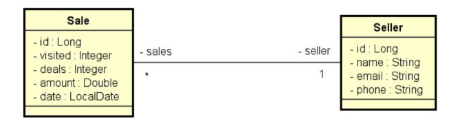

# 📊 Sales Report API — Spring Boot

Projeto desenvolvido em **Java com Spring Boot** com o objetivo de praticar modelagem de relacionamentos entre entidades, consultas personalizadas, paginação e geração de relatórios utilizando **Spring Data JPA**.

A aplicação simula um sistema de vendas, onde cada venda está associada a um vendedor, permitindo geração de relatórios e sumários com filtros opcionais por período e nome.

---

## 👨‍💻 Contexto do Sistema

O sistema é composto por duas entidades principais:

- **Seller**
- **Sale**

Relacionamento:

- Um vendedor pode possuir várias vendas
- Cada venda pertence a um único vendedor

---

## 🧩 Modelo de Domínio

### 📊 Diagrama de Entidades

---

## 🚀 Funcionalidades Implementadas

### 1️⃣ Relatório de Vendas (paginado)

Permite filtrar vendas com base em:

- Data inicial (opcional)
- Data final (opcional)
- Trecho do nome do vendedor (opcional)

Retorna listagem paginada contendo:

- Id da venda
- Data
- Valor da venda
- Nome do vendedor

Regras aplicadas:

- Se data final não informada → considera data atual do sistema
- Se data inicial não informada → considera 1 ano antes da data final
- Se nome não informado → considera string vazia

Tratamento dos parâmetros é realizado na camada de serviço.

---

### 2️⃣ Sumário de Vendas por Vendedor

Permite filtrar por:

- Data inicial (opcional)
- Data final (opcional)

Retorna:

- Nome do vendedor
- Soma total de vendas no período

---

## 🏗️ Arquitetura

O projeto segue organização em camadas:

- **Controller**
    - Recebimento de parâmetros e exposição dos endpoints
- **Service**
    - Tratamento de regras e manipulação de datas
- **Repository**
    - Consultas customizadas com Spring Data JPA
- **DTO / Projections**
    - Estruturas específicas para retorno de relatórios

Essa separação favorece organização, baixo acoplamento e clareza de responsabilidades.

---

## 🧠 Conceitos Praticados

- Relacionamento Many-to-One com JPA
- Consultas customizadas com @Query
- Paginação com PageRequest
- Filtros dinâmicos
- Manipulação de datas com LocalDate
- Projeções para relatórios
- Organização em camadas

---

## 🚀 Tecnologias Utilizadas

- Java
- Spring Boot
- Spring Data JPA
- Hibernate
- Banco H2 (ambiente de testes)
- Maven

---

